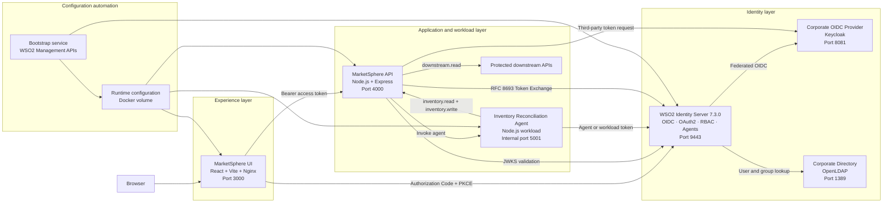

# MarketSphere Identity POC

A complete, containerized identity and access management demonstration built with **WSO2 Identity Server 7.3.0**.

The project demonstrates how WSO2 Identity Server can secure human users, business APIs, machine-to-machine applications, external corporate identities, LDAP users, delegated token exchange, and non-human agent workloads from a single identity control plane.

The demo includes a React user interface, protected Node.js APIs, a corporate OpenID Connect provider, an LDAP directory, automated WSO2 configuration, and end-to-end security tests.

---

## Table of contents

* [Overview](#overview)
* [Capabilities demonstrated](#capabilities-demonstrated)
* [Architecture](#architecture)
* [Components](#components)
* [Security model](#security-model)
* [Prerequisites](#prerequisites)
* [Starting the environment](#starting-the-environment)
* [Access URLs](#access-urls)
* [Demo users](#demo-users)
* [End-to-end UI tests](#end-to-end-ui-tests)
* [Automated smoke validation](#automated-smoke-validation)
* [How each scenario works](#how-each-scenario-works)
* [Bootstrap process](#bootstrap-process)
* [Agent identity behavior](#agent-identity-behavior)
* [Known bootstrap notes](#known-bootstrap-notes)
* [Stopping and resetting the environment](#stopping-and-resetting-the-environment)
* [Troubleshooting](#troubleshooting)
* [Production considerations](#production-considerations)
* [Official WSO2 documentation](#official-wso2-documentation)
* [Coverage summary](#coverage-summary)
* [Out-of-scope capabilities](#out-of-scope-capabilities)

---

## Overview

MarketSphere is a fictional enterprise marketplace used to demonstrate identity and API security patterns with WSO2 Identity Server 7.3.0.

The environment validates the following identity types:

* Local WSO2 users
* Users stored in a secondary corporate LDAP directory
* Users authenticated through an external OpenID Connect provider
* Confidential machine-to-machine applications
* Delegated users represented through OAuth 2.0 Token Exchange
* AI agent identities and dedicated non-human workloads

The demo is fully bootstrapped through APIs and configuration files. No manual WSO2 Console configuration is required for a normal startup.

The web interface is available at:

```text
http://localhost:3000
```

---

## Capabilities demonstrated

### Authentication

* OpenID Connect login
* OAuth 2.0 Authorization Code flow
* PKCE with the `S256` challenge method
* ID token validation
* Access token handling
* OIDC logout
* Local username and password authentication
* Federated OIDC authentication
* Authentication against a secondary LDAP user store

### Authorization

* Business API registration
* API resources and scopes
* Application-specific roles
* User-to-role assignment
* Group-aware authorization
* Scope validation at protected APIs
* Role-based access control
* Positive and negative authorization decisions
* Separation between authentication and authorization

### Machine identities

* OAuth 2.0 Client Credentials
* Confidential client authentication
* Scoped workload tokens
* Server-side secret handling
* Protected machine-to-machine API calls

### Delegation

* OAuth 2.0 Token Exchange
* Third-party JWT validation
* Trusted token issuer configuration
* JWKS-based signature validation
* Implicit local-account association
* Mapped local subject resolution
* Local RBAC applied to an externally authenticated identity
* Downstream token issuance with reduced privileges

### Agent identity

* First-class WSO2 agent registration
* Unique agent identifier
* Agent owner metadata
* Agent role assignment
* Dedicated workload credentials
* Least-privilege agent scopes
* Protected API execution
* Business-level agent execution result
* Technical token details for audit and troubleshooting

### Operational automation

* Docker Compose deployment
* Idempotent bootstrap
* API-driven WSO2 application creation
* API-resource and scope creation
* Role and user assignment
* OIDC connection configuration
* Login-flow configuration
* Trusted issuer registration
* Runtime configuration publication
* Automated smoke testing

---

## Architecture



### Main request flows

#### User login

```text
Browser
  → MarketSphere UI
  → WSO2 authorization endpoint
  → User authentication
  → Authorization code
  → PKCE-protected token request
  → Access token and ID token
  → Protected MarketSphere API
```

#### Federated login

```text
Browser
  → WSO2 Identity Server
  → Corporate-OIDC-Keycloak
  → External user authentication
  → Corporate claims
  → WSO2 claim normalization
  → MarketSphere application
```

#### Token exchange

```text
Carol's portal session
  → MarketSphere backend
  → Keycloak source token for Alice
  → WSO2 trusted token issuer validation
  → External Alice linked to local WSO2 Alice
  → Local role token-exchange-service
  → Exchanged token with downstream.read
  → Protected downstream report
```

#### Agent execution

```text
Carol starts the operation
  → MarketSphere API authorizes portal.admin
  → Inventory Reconciliation Agent starts
  → Agent obtains its own workload token
  → WSO2 issues inventory.read and inventory.write
  → Agent invokes protected inventory API
  → API authorizes the workload
  → Reconciliation completes
```

---

## Components

| Component             | Purpose                                       | Local address                    |
| --------------------- | --------------------------------------------- | -------------------------------- |
| MarketSphere UI       | Interactive identity demonstration            | `http://localhost:3000`          |
| MarketSphere API      | Protected business APIs and orchestration     | `http://localhost:4000`          |
| WSO2 Identity Server  | Identity provider and authorization server    | `https://localhost:9443`         |
| WSO2 Console          | Administrative interface                      | `https://localhost:9443/console` |
| Keycloak              | Reproducible external corporate OIDC provider | `http://localhost:8081`          |
| OpenLDAP              | Secondary corporate user store                | `ldap://localhost:1389`          |
| Inventory Agent       | Non-human inventory workload                  | Internal Docker port `5001`      |
| Bootstrap             | Idempotent identity configuration             | Runs during startup              |
| Runtime configuration | Shared generated client and resource metadata | Docker volume                    |

### Repository structure

```text
.
├── bootstrap/
│   └── bootstrap.py
├── platform/
│   ├── keycloak/
│   │   └── realm.json
│   ├── ldap/
│   │   └── bootstrap.ldif
│   └── wso2/
│       ├── deployment.toml
│       └── userstores/
├── services/
│   ├── inventory-agent/
│   └── marketplace-api/
├── ui/
│   ├── index.html
│   └── src/
│       ├── main.jsx
│       └── styles.css
├── docker-compose.yml
├── demo.sh
└── README.md
```

---

## Security model

### Human-user authorization

The Portal application requests these scopes:

```text
openid
profile
email
portal.read
portal.admin
```

WSO2 only grants business scopes that the authenticated user is authorized to receive.

The protected API performs two checks:

1. The token must contain the required scope.
2. The principal must belong to an accepted group or application role.

For example:

```text
Corporate Portal:
  scope: portal.read
  group: portal_users or portal_admins
  role: portal-user or portal-admin

Administrative operation:
  scope: portal.admin
  group: portal_admins
  role: portal-admin
```

### Machine authorization

The Orders Service authenticates with its own confidential client and requests:

```text
orders.read
```

The secret remains in the backend. It is never returned to the browser.

### Token-exchange authorization

The Token Exchange Backend is authorized for:

```text
downstream.read
```

The external Keycloak identity for Alice is associated with local WSO2 Alice through:

```text
preferred_username
  → http://wso2.org/claims/username
  → local user alice
```

Local Alice has the application role:

```text
token-exchange-service
```

That role grants:

```text
downstream.read
```

### Agent authorization

The Inventory Reconciliation Agent is limited to:

```text
inventory.read
inventory.write
```

The agent does not execute with Carol's access token. Carol authorizes the operation, but the agent authenticates independently using its own non-human workload credentials.

---

## Prerequisites

Required software:

* Docker
* Docker Compose v2
* Bash or Zsh
* `curl`
* Python 3
* A modern browser

Optional for local UI development:

* Node.js
* npm

### macOS with Colima

Start Colima before running the environment:

```bash
colima start
docker info
docker compose version
```

If Docker reports that it cannot connect to the Colima socket:

```bash
colima stop
colima start
docker context use colima
docker info
```

---

## Starting the environment

Make the demo script executable:

```bash
chmod +x demo.sh
```

Start the complete environment:

```bash
./demo.sh up
```

Alternatively:

```bash
docker compose up --build
```

The startup process:

1. Starts OpenLDAP.
2. Starts the corporate Keycloak realm.
3. Starts WSO2 Identity Server 7.3.0.
4. Waits for the identity services to become healthy.
5. Runs the bootstrap process.
6. Publishes the runtime configuration.
7. Starts the protected API.
8. Starts the Inventory Agent.
9. Starts the UI.

### Accept the local WSO2 certificate

The demo uses a local self-signed TLS certificate.

Open this URL once:

```text
https://localhost:9443/console
```

Accept the browser warning before testing OIDC login.

### Verify container status

```bash
docker compose ps
```

Expected state:

```text
ldap               healthy
keycloak           healthy
wso2is             healthy
bootstrap          exited with code 0
marketplace-api    healthy
inventory-agent    healthy
ui                 running
```

---

## Access URLs

| Interface                  | URL                                              |
| -------------------------- | ------------------------------------------------ |
| MarketSphere UI            | `http://localhost:3000`                          |
| MarketSphere API health    | `http://localhost:4000/health`                   |
| WSO2 Console               | `https://localhost:9443/console`                 |
| WSO2 JWKS                  | `https://localhost:9443/oauth2/jwks`             |
| Keycloak                   | `http://localhost:8081`                          |
| Keycloak corporate account | `http://localhost:8081/realms/corporate/account` |

Default administrative credentials can be overridden using environment variables.

| System                  | Default username | Default password |
| ----------------------- | ---------------- | ---------------- |
| WSO2 Console            | `admin`          | `admin`          |
| Keycloak Administration | `admin`          | `admin`          |

These defaults are for local demonstrations only.

---

## Demo users

### Local WSO2 users

| User    | Password    | Access profile                                                   |
| ------- | ----------- | ---------------------------------------------------------------- |
| `alice` | `Alice@123` | Portal user; finance group; delegated token-exchange subject     |
| `bob`   | `Bob@1234`  | Valid user without Portal authorization                          |
| `carol` | `Carol@123` | Portal administrator; can run token exchange and agent execution |

### Secondary LDAP users

| User           | Password        | Access profile                                                |
| -------------- | --------------- | ------------------------------------------------------------- |
| `CORP/diana`   | `Corporate@123` | Corporate LDAP user associated with portal and finance groups |
| `CORP/eduardo` | `Corporate@123` | Corporate LDAP user expected to be denied Portal access       |

### Federated OIDC user

Select **Corporate-OIDC-Keycloak** on the WSO2 login page.

| User             | Password        | Access profile                                      |
| ---------------- | --------------- | --------------------------------------------------- |
| `federated.user` | `Federated@123` | External OIDC user with corporate claims and groups |

### Token-exchange source identity

The backend obtains an external Keycloak token representing:

```text
alice / Alice@123
```

This credential remains on the server and is used only to make the local demonstration reproducible.

---

## End-to-end UI tests

Open:

```text
http://localhost:3000
```

Use a private browser window or fully sign out between personas.

---

### Test 1: Authorization Code, OIDC, and PKCE

**User**

```text
alice / Alice@123
```

**Steps**

1. Open **Authorization Code**.
2. Click **Authenticate user**.
3. Sign in as Alice.
4. Return to the UI.
5. Confirm that the access token and ID token claims are displayed.
6. Click **Validate token with the API**.

**Expected result**

* Login redirects through WSO2.
* The request uses Authorization Code with PKCE.
* The code challenge method is `S256`.
* An access token and ID token are issued.
* The ID token passes issuer, audience, nonce, and expiration validation.
* The protected API returns an authenticated principal.
* Alice receives `portal.read`.
* Alice does not receive `portal.admin`.

---

### Test 2: Portal access with Alice

**User**

```text
alice / Alice@123
```

**Steps**

1. Open **RBAC and groups**.
2. Click **Test Corporate Portal**.

**Expected result**

```text
decision: allow
```

Alice should have:

```text
scope: portal.read
group: portal_users
role: portal-user
```

Then click **Test admin operation**.

Expected result:

```text
HTTP 403
missing_scope or RBAC access denied
required: portal.admin
```

This demonstrates least privilege.

---

### Test 3: Token-exchange initiation denied for Alice

**User**

```text
alice / Alice@123
```

**Steps**

1. Open **Token Exchange**.
2. Click **Run token exchange**.

**Expected result**

```text
HTTP 403
required scope: portal.admin
```

Alice is the delegated subject of the exchange but is not allowed to initiate the administrative demonstration.

---

### Test 4: Full administrator flow with Carol

**User**

```text
carol / Carol@123
```

**Steps**

1. Sign out from Alice.
2. Sign in as Carol.
3. Open **RBAC and groups**.
4. Click **Test Corporate Portal**.
5. Click **Test admin operation**.

**Expected result**

Carol receives:

```text
portal.read
portal.admin
```

Expected roles:

```text
portal-user
portal-admin
```

Both Portal and administrative operations should return:

```text
decision: allow
```

---

### Test 5: Complete OAuth 2.0 Token Exchange

**User initiating the operation**

```text
carol / Carol@123
```

**Steps**

1. Open **Token Exchange**.
2. Click **Run token exchange**.
3. Inspect the source token, exchanged token, and downstream result.

**Expected result**

The response shows three distinct identities or responsibilities.

#### Initiating user

```text
username: carol
scope: portal.admin
role: portal-admin
```

#### External subject token

```text
provider: Corporate-OIDC-Keycloak
preferred_username: alice
email: alice@marketsphere.local
groups:
  - portal_users
  - finance_users
```

#### Exchanged WSO2 token

```text
username: alice
role: token-exchange-service
scope: downstream.read
```

The exchanged token subject should be local WSO2 Alice rather than the Keycloak UUID.

#### Downstream response

```json
{
  "decision": "allow",
  "report": {
    "quarter": "Q3 2026",
    "risk": "LOW",
    "pendingApprovals": 3
  }
}
```

This demonstrates:

* Separation of duties
* Third-party JWT validation
* Trusted issuer and JWKS validation
* Implicit local-account linking
* Local RBAC
* Scope reduction
* Delegated downstream access

---

### Test 6: Authenticated but unauthorized Bob

**User**

```text
bob / Bob@1234
```

**Steps**

1. Sign in as Bob.
2. Open **RBAC and groups**.
3. Click **Test Corporate Portal**.
4. Try the administrative operation.

**Expected result**

Bob has valid credentials and can authenticate, but he is not assigned to an authorized Portal group or role.

Expected result:

```text
HTTP 403
rbac_access_denied or missing_scope
```

Bob must not receive:

```text
portal.read
portal.admin
```

This demonstrates that authentication does not automatically imply authorization.

---

### Test 7: OAuth 2.0 Client Credentials

No interactive login is required.

**Steps**

1. Open **Client Credentials**.
2. Click **Run complete flow**.
3. Inspect the issued token and protected API result.

**Expected result**

* The Orders Service authenticates with its client ID and secret.
* WSO2 issues a token containing:

```text
orders.read
```

* The secret remains on the backend.
* The Orders API validates the JWT and scope.
* The protected API returns an order list.

The token should identify an application rather than a human user:

```text
aut: APPLICATION
grant_type: client_credentials
```

---

### Test 8: Federated OIDC login

**User**

```text
federated.user / Federated@123
```

**Steps**

1. Sign out from the current user.
2. Start a new OIDC login.
3. On the WSO2 login page, choose **Corporate-OIDC-Keycloak**.
4. Authenticate as `federated.user`.
5. Return to the MarketSphere UI.
6. Open **Authorization Code** and inspect the claims.

**Expected result**

The browser follows this path:

```text
MarketSphere
  → WSO2 Identity Server
  → Corporate Keycloak
  → WSO2 Identity Server
  → MarketSphere
```

Expected corporate attributes include:

```text
preferred_username
email
given_name
family_name
department
groups
```

The connection maps external attributes into WSO2 local claims.

---

### Test 9: Corporate LDAP user Diana

**User**

```text
CORP/diana / Corporate@123
```

**Steps**

1. Start a local username-and-password login.
2. Enter the user-store-qualified username.
3. Confirm that authentication is performed against the `CORP` user store.
4. Open **RBAC and groups**.
5. Test Portal access.

**Expected result**

* WSO2 finds Diana in the secondary LDAP user store.
* The identity remains in the `CORP` domain.
* Passwords are validated against LDAP.
* Portal authorization depends on successful external group resolution.

See [Known bootstrap notes](#known-bootstrap-notes) for the current LDAP group limitation.

---

### Test 10: Corporate LDAP negative authorization

**User**

```text
CORP/eduardo / Corporate@123
```

**Steps**

1. Sign in with Eduardo's LDAP credentials.
2. Attempt to access the Corporate Portal.

**Expected result**

Authentication should succeed, but Portal access should be denied because Eduardo is not a member of the required Portal authorization group.

---

### Test 11: Agent identity and reconciliation

**Initiating user**

```text
carol / Carol@123
```

**Steps**

1. Sign in as Carol.
2. Open **Agent Identity**.
3. Click **Run reconciliation**.
4. Inspect the business result.
5. Expand the technical token and API response details.

**Expected business result**

```text
Inventory reconciliation completed successfully
API decision: ALLOW
Items compared: 1248
Records adjusted: 7
Exceptions found: 2
Status: COMPLETED
```

The response should include a unique run ID:

```text
REC-<timestamp>
```

**Expected security result**

```text
Agent: Inventory Reconciliation Agent
Owner: carol
Role: inventory-agent
Scopes:
  - inventory.read
  - inventory.write
```

The protected API should return:

```text
decision: allow
identityType: DEDICATED_WORKLOAD_FALLBACK
```

The user only authorizes the start of the operation. The agent uses its own workload identity and token.

---

## Automated smoke validation

Run:

```bash
./demo.sh smoke
```

Expected checks:

```text
[pass] WSO2 Identity Server JWKS
[pass] Corporate OIDC discovery
[pass] Runtime configuration targets WSO2 IS 7.3.0
[pass] Client Credentials, JWT issuance, scope, and protected API validation
[pass] Agent identity and role metadata
[pass] Trusted token issuer configuration

Smoke validation passed.
```

The smoke test validates non-interactive infrastructure and token flows.

The following scenarios remain interactive and should be validated through the UI:

* Authorization Code and PKCE
* Local user login
* RBAC allow and deny
* Federated login
* Secondary LDAP login
* Token exchange
* Agent execution

---

## How each scenario works

### Authorization Code with PKCE

The React application is a public client and does not store a client secret.

It generates:

```text
code_verifier
code_challenge
state
nonce
```

The authorization request uses:

```text
response_type=code
code_challenge_method=S256
```

After login, the UI exchanges the authorization code using the original verifier.

The UI validates:

* Issuer
* Audience
* Nonce
* Expiration

### JWT validation

The MarketSphere API validates access tokens using WSO2's JWKS endpoint.

It verifies:

* RSA signature
* Issuer
* Expiration
* Accepted audience
* Required scopes

The API normalizes roles and groups from common token claim formats.

### RBAC

The demo registers business API resources and scopes in WSO2.

Applications are authorized for selected API resources. Application roles group the permissions, and users are assigned to those roles.

The API additionally enforces the expected group or role to make authorization decisions explicit in the demonstration.

### Client Credentials

A confidential application authenticates directly to the WSO2 token endpoint.

The resulting token identifies the application:

```text
aut: APPLICATION
```

The M2M client can only request its authorized scope.

### OIDC federation

Keycloak acts as a reproducible corporate OIDC provider.

WSO2 is registered as an OIDC client in Keycloak and exposes the connection as a login option in the Portal application.

External claims are mapped into WSO2 claims, including:

```text
preferred_username → username
email              → emailaddress
department         → department
groups             → roles
```

The same architecture can be adapted to another standards-compliant OIDC provider, including Microsoft Entra ID.

### Secondary LDAP

The `CORP` user store is mounted into WSO2 as a secondary LDAP user store.

Users are addressed with a domain-qualified username:

```text
CORP/<username>
```

WSO2 reads user identities and groups from OpenLDAP without copying their passwords into the local WSO2 user store.

### Token exchange

The backend obtains an external JWT from Keycloak and submits it to the WSO2 token endpoint using the OAuth 2.0 Token Exchange grant:

```text
urn:ietf:params:oauth:grant-type:token-exchange
```

WSO2 validates:

* External issuer
* Token audience or trusted-issuer alias
* JWT signature
* JWKS
* Token validity

The trusted issuer maps:

```text
preferred_username
  → http://wso2.org/claims/username
```

Implicit account linking resolves the external identity to local Alice.

The Token Exchange Backend requires a linked local subject and uses local-account attributes. Therefore, Alice's local role is used when WSO2 decides whether to issue `downstream.read`.

### Agent execution

The bootstrap registers a first-class managed agent identity and associates role metadata with it.

The runtime first attempts to use managed-agent authentication when the required app-native configuration is available.

In the current environment, WSO2 returns HTTP `400` for the attempted app-native application flag. The agent therefore uses a dedicated confidential workload client.

This fallback still preserves the important security properties:

* The workload has its own identity.
* It does not use the signed-in user's token.
* Its secret remains server-side.
* It receives only `inventory.read` and `inventory.write`.
* The protected API explicitly recognizes the dedicated workload.
* The business operation is completed and returned to the UI.

The current demo proves first-class agent registration and workload-level authorization. It does not claim that native Agent ID authentication is active while the fallback mode is in use.

---

## Bootstrap process

The bootstrap service configures the environment automatically.

It creates or verifies:

* Local users
* Local groups
* Portal application
* M2M application
* Token Exchange Backend
* Agent application
* Dedicated agent workload application
* Business API resources
* API scopes
* Authorized APIs
* Application roles
* User-role assignments
* Managed agent identity
* Agent role assignment
* Corporate OIDC identity provider
* Portal authentication flow
* Trusted third-party token issuer
* Trusted issuer JWKS
* Implicit account linking
* Mapped local-subject requirements
* Runtime configuration

The generated runtime configuration is stored in a Docker volume and shared with:

* MarketSphere UI
* MarketSphere API
* Inventory Agent

Sensitive values are removed from the browser-facing configuration.

### Bootstrap completion

A successful bootstrap ends with:

```text
[ok] Registered Corporate Keycloak as a trusted third-party JWT issuer
[ok] Configured username-based local account linking for token exchange RBAC
[ok] Published runtime configuration for API, agent, and UI
bootstrap exited with code 0
```

---

## Agent identity behavior

The agent demonstration distinguishes between two concepts.

### Managed agent identity

WSO2 stores a first-class agent record with:

* Agent ID
* Display name
* Owner
* Role
* Agent-specific metadata

This allows the agent to remain distinguishable from normal human users.

### Workload authentication

The software process executing the agent operation needs a credential with which it can obtain an access token.

The current environment exposes two modes:

| Mode                          | Description                                             |
| ----------------------------- | ------------------------------------------------------- |
| `managed-agent`               | Uses Agent ID credentials and app-native authentication |
| `client-credentials-fallback` | Uses a dedicated OAuth workload client                  |

The current tested mode is:

```text
client-credentials-fallback
```

The UI explicitly reports this mode rather than presenting it as native managed-agent authentication.

A successful result includes:

```json
{
  "decision": "allow",
  "identityType": "DEDICATED_WORKLOAD_FALLBACK",
  "reconciliation": {
    "compared": 1248,
    "adjusted": 7,
    "exceptions": 2,
    "status": "COMPLETED"
  }
}
```

---

## Known bootstrap notes

The UI may display the following notes.

### LDAP group note

```text
LDAP users are available, but the external portal_users group was not returned through SCIM during bootstrap
```

This means:

* WSO2 can connect to the secondary LDAP user store.
* LDAP users can be found.
* LDAP authentication can be tested.
* The bootstrap could not confirm the external `portal_users` group through SCIM.

This affects automated verification of LDAP group-driven Portal authorization.

It does not mean the LDAP connection itself is unavailable.

### Agent app-native note

```text
The app-native application flag returned 400; the dedicated client-credentials fallback remains available
```

This means:

* The managed agent identity exists.
* The agent role metadata exists.
* The attempted app-native application property was rejected.
* The agent execution uses its dedicated workload OAuth client.
* Agent reconciliation remains functional and protected by scopes.

---

## Stopping and resetting the environment

### Stop containers

```bash
docker compose down
```

### Stop and remove volumes

This deletes the persistent WSO2 databases and generated runtime configuration:

```bash
docker compose down -v --remove-orphans
```

Start a clean environment again:

```bash
./demo.sh up
```

### Rebuild only the UI

```bash
docker compose up -d \
  --no-deps \
  --build \
  --force-recreate \
  ui
```

### Rebuild the API

```bash
docker compose up -d \
  --no-deps \
  --build \
  --force-recreate \
  marketplace-api
```

### Rerun bootstrap

```bash
docker compose rm -sf bootstrap 2>/dev/null || true

docker compose up \
  --build \
  --force-recreate \
  bootstrap
```

---

## Troubleshooting

### Docker daemon unavailable with Colima

Error:

```text
Cannot connect to the Docker daemon at unix://.../.colima/default/docker.sock
```

Resolution:

```bash
colima stop
colima start
docker context use colima
docker info
```

### WSO2 login does not return to the UI

Open and accept the local certificate:

```text
https://localhost:9443/console
```

Then perform a hard browser refresh.

### UI shows an old version

Use:

```text
Cmd + Shift + R
```

Or rebuild the UI:

```bash
docker compose up -d \
  --no-deps \
  --build \
  --force-recreate \
  ui
```

### Marketplace API is unhealthy

Inspect:

```bash
docker compose logs \
  --no-color \
  --tail=300 \
  marketplace-api
```

The health check must use IPv4 loopback:

```text
http://127.0.0.1:4000/health
```

Using `localhost` may resolve to IPv6 `::1`, while the Node.js server listens on IPv4 `0.0.0.0`.

### Inventory Agent is unhealthy

Inspect:

```bash
docker compose logs \
  --no-color \
  --tail=300 \
  inventory-agent
```

The health check must use:

```text
http://127.0.0.1:5001/health
```

### Token exchange returns missing `portal.admin`

The user initiating the flow must be Carol:

```text
carol / Carol@123
```

Alice is the delegated subject but cannot initiate the administrative operation.

### Token exchange returns no `downstream.read`

Verify:

* Trusted token issuer exists.
* Implicit association is enabled.
* Lookup attribute is `http://wso2.org/claims/username`.
* `preferred_username` maps to the WSO2 username claim.
* The application requires a mapped local subject.
* Local Alice has `token-exchange-service`.
* The role grants `downstream.read`.

### Check recent logs

```bash
docker compose logs \
  --no-color \
  --tail=300 \
  bootstrap \
  marketplace-api \
  inventory-agent \
  ui
```

---

## Production considerations

This repository is a local proof of concept, not a production deployment.

Before production use:

* Replace all demonstration passwords.
* Store secrets in a secrets manager.
* Remove credentials from static configuration.
* Replace local self-signed certificates.
* Enable proper TLS hostname verification.
* Remove `NODE_TLS_REJECT_UNAUTHORIZED=0`.
* Use production databases instead of embedded H2 databases.
* Use production-grade LDAP or Active Directory connectivity.
* Configure database backup and recovery.
* Configure high availability.
* Configure monitoring and audit-log collection.
* Rotate OAuth client secrets.
* Rotate agent credentials.
* Use short-lived access tokens where appropriate.
* Restrict management API network access.
* Avoid the resource-owner password flow used to make the Keycloak source-token demonstration reproducible.
* Obtain the external subject token through the real upstream application or identity flow.
* Validate unique account-linking attributes across all user stores.
* Review consent requirements.
* Review CORS configuration.
* Apply WSO2 product updates.
* Test disaster recovery and key rotation.

### Demonstration-only source token

The Token Exchange demonstration obtains Alice's external JWT through a server-side password grant to Keycloak.

This was chosen only to make the POC deterministic and repeatable.

A production implementation should receive the external token from the legitimate upstream client or delegated user interaction rather than storing an external user's password.

---

## Official WSO2 documentation

The implementation is based on capabilities documented for WSO2 Identity Server 7.3.

### OIDC public clients and PKCE

* [OAuth2/OIDC public clients](https://is.docs.wso2.com/en/7.3.0/complete-guides/fesecurity/public-clients/)
* [Authorization Code flow with PKCE](https://is.docs.wso2.com/en/7.3.0/guides/authentication/oidc/implement-auth-code-with-pkce/)
* [Configure OIDC flows](https://is.docs.wso2.com/en/7.3.0/guides/authentication/oidc/)

### OAuth grant types and M2M applications

* [OAuth 2.0 grant types](https://is.docs.wso2.com/en/7.3.0/references/grant-types/)
* [Register a machine-to-machine application](https://is.docs.wso2.com/en/7.3.0/guides/applications/register-machine-to-machine-app/)

### API resources, scopes, and RBAC

* [API Authorization with Role-Based Access Control](https://is.docs.wso2.com/en/7.3.0/guides/authorization/api-authorization/api-authorization/)
* [OAuth 2.0 Scope Management API](https://is.docs.wso2.com/en/7.3.0/apis/oauth2-scope-management-rest-apis/)

### OIDC federation

* [Add login with an OpenID Connect identity provider](https://is.docs.wso2.com/en/7.3.0/guides/authentication/standard-based-login/add-oidc-idp-login/)
* [Identity Provider Management API](https://is.docs.wso2.com/en/7.3.0/apis/idp/)

### User stores

* [Configure secondary user stores](https://is.docs.wso2.com/en/7.3.0/guides/users/user-stores/configure-secondary-user-stores/)
* [User Store Management API](https://is.docs.wso2.com/en/7.3.0/apis/user-store-rest-api/)

### Token exchange

* [Configure OAuth 2.0 Token Exchange](https://is.docs.wso2.com/en/7.3.0/guides/authentication/configure-token-exchange/)

The WSO2 token-exchange documentation covers:

* Trusted token issuer registration
* JWT issuer validation
* JWKS configuration
* Token-exchange grant enablement
* Local-account attribute resolution
* Requiring a linked local account
* Implicit account linking
* Desired scope requests

### AI agent identities

* [AI Agent Management API](https://is.docs.wso2.com/en/7.3.0/apis/scim2-agents-rest-apis/)
* [Register and manage agents](https://is.docs.wso2.com/en/7.3.0/guides/agentic-ai/ai-agents/register-and-manage-agents/)
* [Access control for agents](https://is.docs.wso2.com/en/7.3.0/guides/agentic-ai/ai-agents/access-control-for-agents/)
* [Agent credentials](https://is.docs.wso2.com/en/7.3.0/guides/agentic-ai/ai-agents/agent-credentials/)

---

## Coverage summary

| WSO2 Identity Server capability     | Demonstrated | Validation               |
| ----------------------------------- | -----------: | ------------------------ |
| OIDC Authorization Code             |          Yes | UI                       |
| PKCE with S256                      |          Yes | UI                       |
| ID token validation                 |          Yes | UI                       |
| JWT access tokens                   |          Yes | UI and smoke test        |
| JWKS validation                     |          Yes | API and smoke test       |
| Local users                         |          Yes | UI                       |
| Groups                              |          Yes | UI and API               |
| Application roles                   |          Yes | UI and API               |
| Business API resources              |          Yes | Bootstrap and API        |
| OAuth scopes                        |          Yes | UI, API, and smoke test  |
| RBAC allow decision                 |          Yes | UI                       |
| RBAC deny decision                  |          Yes | UI                       |
| Client Credentials                  |          Yes | UI and smoke test        |
| OIDC federation                     |          Yes | UI and discovery test    |
| Secondary LDAP user store           |          Yes | Bootstrap and UI         |
| External LDAP group verification    |      Partial | Bootstrap warning        |
| Trusted token issuer                |          Yes | Bootstrap and smoke test |
| OAuth 2.0 Token Exchange            |          Yes | UI                       |
| Implicit account linking            |          Yes | UI                       |
| Local RBAC after token exchange     |          Yes | UI                       |
| First-class agent registration      |          Yes | Bootstrap and smoke test |
| Agent owner and role metadata       |          Yes | UI and smoke test        |
| Native managed-agent authentication |   Not active | App-native flag rejected |
| Dedicated agent workload fallback   |          Yes | UI                       |
| Agent protected API execution       |          Yes | UI                       |
| Agent reconciliation result         |          Yes | UI                       |
| Idempotent API bootstrap            |          Yes | Startup                  |

---

## Out-of-scope capabilities

The project does not currently demonstrate:

* Multi-factor authentication
* Passwordless authentication
* Passkeys
* Adaptive authentication
* Risk-based authentication
* SAML
* WS-Federation
* Social login
* User self-registration
* Account recovery
* Approval workflows
* Consent-management workflows
* SCIM outbound provisioning
* User lifecycle synchronization
* FAPI
* DPoP
* Mutual TLS
* Rich Authorization Requests
* Verifiable credentials
* Production high availability
* Production database deployment
* Full native Agent ID authentication

These capabilities may be added as separate scenarios without changing the core architecture.

---

## Final acceptance criteria

The POC is considered successfully validated when:

* All required containers are healthy.
* Bootstrap exits with code `0`.
* `./demo.sh smoke` passes.
* Alice can access the Portal but not admin operations.
* Bob authenticates but cannot access the Portal.
* Carol can access Portal and admin operations.
* Federated login redirects through Keycloak and returns corporate claims.
* LDAP users can be discovered and authenticate.
* Carol can initiate token exchange for external Alice.
* The exchanged token resolves local Alice.
* The exchanged token contains `downstream.read`.
* The downstream API returns `decision: allow`.
* The Inventory Agent receives its own scoped token.
* The agent API returns `decision: allow`.
* Inventory reconciliation returns `status: COMPLETED`.
* The UI shows the business-level agent result and retains technical details for inspection.

<!-- CUSTOMER-RFP-DEMO-START -->

---

## Customer RFP / B2B demonstration profile

This repository includes an extended customer demonstration profile for **WSO2 Identity Server 7.3**.

The original scenarios remain unchanged:

- Authorization Code + PKCE
- OIDC and JWT validation
- local RBAC allow/deny
- secondary OpenLDAP user store
- external Keycloak OIDC federation
- Client Credentials / service identity
- OAuth 2.0 Token Exchange (RFC 8693)
- first-class Agent Identity plus dedicated workload credentials
- native My Account application discovery

A second bootstrap phase, `bootstrap/rfp_extension.py`, adds the customer-specific B2B organization model.

### B2B hierarchy

```text
MarketSphere Retail Brazil
├── Seller Alpha Commerce
│   └── Seller Alpha Logistics
└── Partner Fintech LATAM

MarketSphere International
└── Marketplace Mexico
```

The extension provisions:

- **6 organizations** across **3 hierarchy levels**
- **8 resident organization users**
- **8 organization-local applications**
- the username `operator` independently in Seller Alpha Commerce and Marketplace Mexico
- the application name `Partner Storefront` independently in Seller Alpha Commerce and Marketplace Mexico

The duplicate names are intentional isolation evidence: they resolve to different WSO2 IDs inside different organization contexts.

### Organization-management flow

The B2B bootstrap uses the supported organization-management pattern:

```text
MarketSphere B2B Bootstrap Client
  → Client Credentials
  → API Authorization
  → create/view organizations in the root context
  → application sharing
  → Organization Switch
  → /o/scim2/Users
  → /o/api/server/v1/applications
  → /o/api/server/v1/organizations
```

The application is first configured with Client Credentials. Organization Switch is enabled only after the application has been shared with at least one organization.

### RFP Demo Center

Open:

```text
http://localhost:3000/rfp-demo.html
```

The page distinguishes:

- `LIVE` — materialized and executable/inspectable in this demo
- `CONFIGURED` — materialized configuration without a dedicated staged transaction
- `PLATFORM` — native product capability shown as evidence, not simulated
- `COMPLEMENTARY` — requires the complementary WSO2 product identified in the RFP response
- `ARCHITECTURE` — deployment/scale property, not meaningfully proven on one laptop
- `CONTRACTUAL` — commercial/support commitment, not a runtime feature

This distinction is intentional. The demo does not fake real SMS delivery, a hardware-backed passkey, a complete enterprise DSAR workflow, APIM API-key lifecycle, Black-Friday capacity, or contractual SLA.

### Full automated preflight

Run:

```bash
./scripts/test-e2e-rfp.sh
```

This executes the repository's existing smoke suite and the customer-specific RFP/B2B validation.

For only the B2B/RFP checks:

```bash
./scripts/validate-rfp-demo.sh
```

Presenter shortcuts:

```bash
./scripts/customer-demo.sh urls
./scripts/customer-demo.sh preflight
./scripts/customer-demo.sh logs
```

### Full demonstration runbook

See:

```text
docs/CUSTOMER_RFP_DEMO.md
```

It contains both a short executive path and the complete technical path.

### Clean-room validation before sharing the repository

First validate against existing persisted state:

```bash
docker compose up --build -d
./scripts/test-e2e-rfp.sh
```

Only after that succeeds, validate reproducibility from zero:

```bash
docker compose down -v --remove-orphans
docker compose up --build -d
docker compose logs -f bootstrap
./scripts/test-e2e-rfp.sh
```

A successful extended bootstrap ends with:

```text
[rfp-bootstrap] CUSTOMER RFP DEMO READY
[rfp-bootstrap] 6 organizations / 3 levels
[rfp-bootstrap] 8 resident users
[rfp-bootstrap] 8 organization-local applications
[rfp-bootstrap] B2B isolation proof populated
```

<!-- CUSTOMER-RFP-DEMO-END -->

> **B2B application sharing:** the bootstrap uses WSO2 IS 7.3 `POST /api/server/v1/applications/share-with-all` with policy `ALL_EXISTING_AND_FUTURE_ORGS`. `Organization Switch` is enabled only after the management application is shared.

### Bootstrap idempotency validation

Before a customer presentation or before sharing the repository, validate that
the generated IAM state can be reconciled more than once:

```bash
./scripts/test-bootstrap-idempotency.sh
```

The test force-recreates the bootstrap container twice against the same WSO2
persistent state. Both runs must exit with code `0` and print
`CUSTOMER RFP DEMO READY`.

The B2B extension obtains a fresh Organization Switch token immediately before
organization-scoped SCIM and application-management operations. Organization
Switch tokens are treated as short-lived organization-context credentials
rather than cached across the whole bootstrap.

## Demo privileged-access boundary

The customer demo intentionally uses a strict privilege boundary:

- root `admin` is shared with **all existing and future organizations**;
- root `admin` receives the **Administrator** role of the WSO2 **Console** application in every organization;
- this grants root `admin` full Console access after switching organization context;
- `alice`, `bob`, and `carol` are explicitly kept out of organization shared access;
- B2B resident users remain resident in their own organization and are not assigned the Console Administrator role by the bootstrap.

The provisioning stage uses the supported **User Sharing API v2** and policy:

```text
ALL_EXISTING_AND_FUTURE_ORGS
```

with a selected role assignment:

```text
Console / Administrator
```

Emergency/idempotent repair:

```bash
./scripts/ensure-admin-access.sh
```

Read-only validation:

```bash
./scripts/verify-admin-boundary.sh
```

After provisioning or repairing access, **log out of WSO2 Console and log back in as `admin`** so the browser session receives the updated organization access.

Expected UI navigation:

```text
Root / Super
├── MarketSphere Retail Brazil          [Switch]
│   ├── Seller Alpha Commerce           [Switch]
│   │   └── Seller Alpha Logistics      [Switch]
│   └── Partner Fintech LATAM           [Switch]
└── MarketSphere International          [Switch]
    └── Marketplace Mexico              [Switch]
```

From each organization context, `admin` can inspect and manage users,
applications, roles, identity providers, login configuration, branding and
child organizations according to the Console Administrator permissions.

The other demo users are intentionally not global administrators. This is a
least-privilege demonstration, not six copies of the root super administrator.

### Demo-day preflight

Before the customer session run:

```bash
./scripts/demo-day-preflight.sh
```

The preflight checks Docker, known port conflicts, bootstrap completion, the
root-admin privilege boundary, repository smoke tests, RFP/B2B state and all
customer-facing HTTP surfaces. It finishes with `DEMO DAY READY` only when all
checks pass.

## Distinct application topology

The demo uses independent addresses for independent browser applications:

```text
Portal Corporativo       http://localhost:3000/
Application Portal       http://localhost:3100/
Finance Workspace        http://localhost:3101/
Security Operations      http://localhost:3102/
```

`Application Portal`, `Finance Workspace`, and `Security Operations` are
separate WSO2 applications with separate client IDs and redirect URIs. Finance
and Security run Authorization Code + PKCE from their own origins. The
Application Portal uses WSO2's native discoverable-application API and opens
the entitled application at its own URL; an existing WSO2 SSO session makes
the subsequent application login seamless while preserving the independent
OIDC client boundary.

The B2B organization applications also have unique addresses:

```text
3201  Retail Governance Console      MarketSphere Retail Brazil
3202  Partner Storefront             Seller Alpha Commerce
3203  Seller Backoffice              Seller Alpha Commerce
3204  Settlement Service             Partner Fintech LATAM
3205  Logistics Integration          Seller Alpha Logistics
3206  International Partner Console  MarketSphere International
3207  Partner Storefront             Marketplace Mexico
3208  Mexico Operations              Marketplace Mexico
```

The two `Partner Storefront` entries deliberately keep the same display name,
but have different WSO2 IDs, owning organizations and URLs. This is the B2B
namespace/isolation demonstration.

The following registered applications intentionally remain non-browser
workloads because they represent machine or agent identities:

```text
Orders M2M Client
Token Exchange Backend
Inventory Agent Application
Inventory Agent Workload Fallback
MarketSphere B2B Bootstrap Client
```

Giving those clients fake web sites would misrepresent their role.

Validate the topology with:

```bash
./scripts/validate-multi-apps.sh
```

### UI test flow for distinct applications

1. Open `http://localhost:3100/` and sign in to the Application Portal.
2. With Alice, the catalog should expose the applications allowed by her
   discoverability groups, including Finance Workspace.
3. Open Finance Workspace. It launches `http://localhost:3101/`, performs its
   own OIDC Authorization Code + PKCE flow, reuses the WSO2 SSO session, and
   calls the finance-specific protected API.
4. With Carol, use Application Portal to launch Security Operations at
   `http://localhost:3102/`; it requires the Security application entitlement
   plus `portal.read` and `portal.admin`.
5. In WSO2 Console as root `admin`, switch among the B2B organizations and
   inspect each application `Access URL`. The eight organization-local apps
   point to `3201` through `3208`, not to the main MarketSphere portal.

### Root admin Console traversal — explicit role assignment

The demo uses a strict access boundary:

```text
admin
  -> shared to ALL_EXISTING_AND_FUTURE_ORGS
  -> shared/shadow user in each organization
  -> Organization Switch
  -> SCIM2 Roles API
  -> Console / Administrator membership in each organization

alice / bob / carol
  -> no B2B shared access

B2B resident users
  -> organization-local
  -> no Console Administrator assignment from bootstrap
```

User sharing and Console authorization are treated as separate operations.
The bootstrap explicitly assigns the shared `admin` identity to the Console
`Administrator` application role inside each organization.

Validation:

```bash
./scripts/ensure-admin-access.sh
./scripts/verify-admin-boundary.sh
```

After changing organization access, fully sign out of the WSO2 Console and
sign in again as `admin` before testing the **Switch** control.

## B2B applications are real OIDC relying parties

The eight organization-local browser applications are not placeholder
Application Management records. Each has its own organization-scoped WSO2
OIDC client:

```text
Retail Governance Console       :3201
Partner Storefront / Seller     :3202
Seller Backoffice               :3203
Settlement Service              :3204
Logistics Integration           :3205
International Partner Console   :3206
Partner Storefront / Mexico     :3207
Mexico Operations               :3208
```

Each client is configured as:

```text
OAuth 2.0 / OpenID Connect
Authorization Code
Public client
PKCE mandatory (S256)
Unique callback URL
Unique JavaScript origin
Organization-specific authorize/token endpoint
```

The browser initiates authentication directly against:

```text
https://localhost:9443/t/carbon.super/o/<ORG_ID>/oauth2/authorize
```

and exchanges the code with:

```text
https://localhost:9443/t/carbon.super/o/<ORG_ID>/oauth2/token
```

Validation:

```bash
./scripts/validate-b2b-oidc.sh
```
